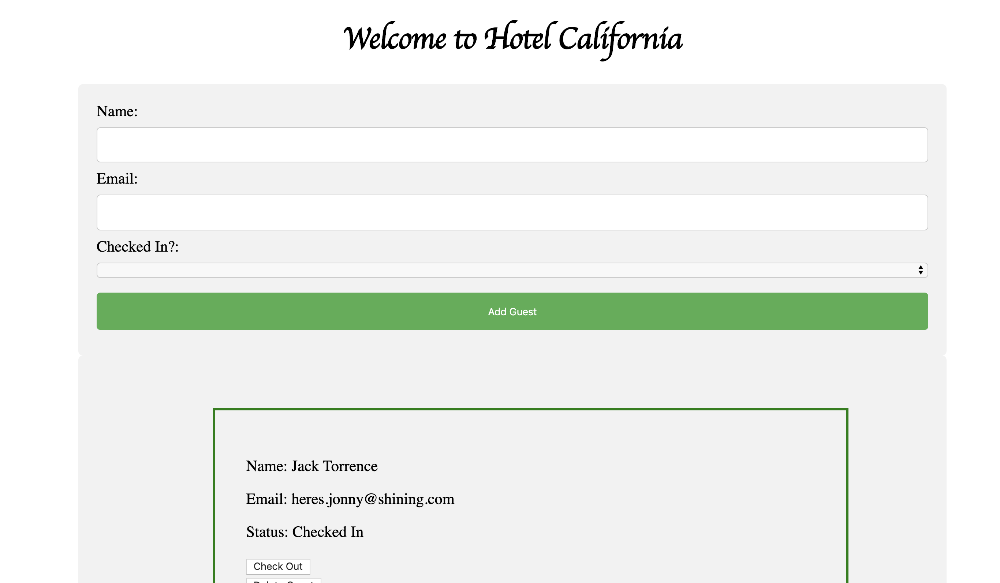
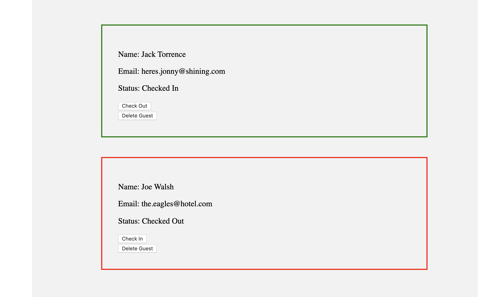

# Full-stack Lab: Hotel Bookings

## Brief

Build a system to allow a hotel to manage bookings. There should be a form to allow the hotel to add the following information for each booking:

- Guest Name
- Guest Email Address
- Checked in status

Bookings should be stored in a MongoDB via an JSON API in Express.

## MVP

- Hotel managers should be able to view a list of all bookings
- Hotel managers should be able to add a new booking, which should update the page without the page being refreshed
- Hotel managers should be able to delete bookings 

## Extensions

- Don't allow a booking to be submitted to the API unless both the name and email address are present

## Advanced Extensions

- Allow the hotel manager to update the "checked in" status of the booking

